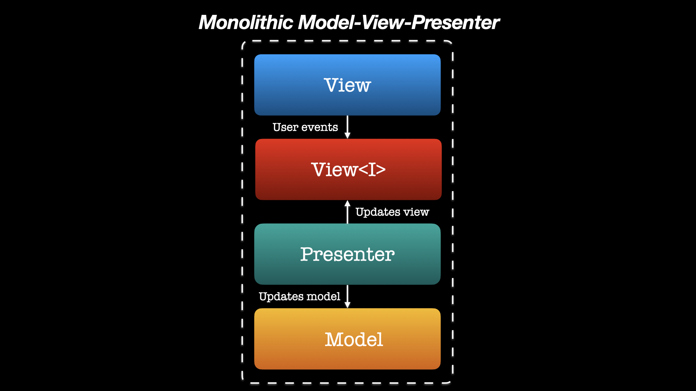
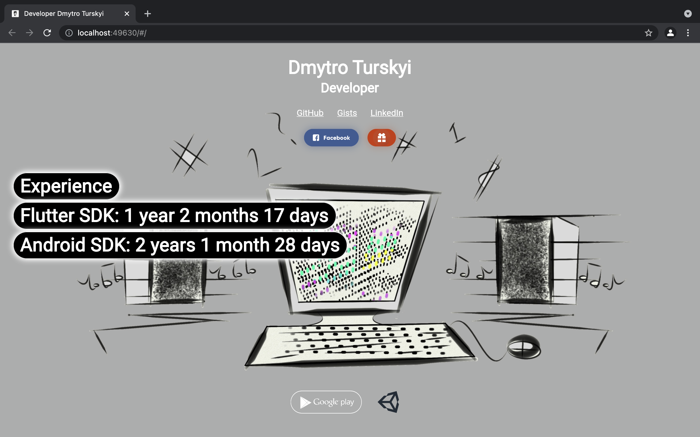
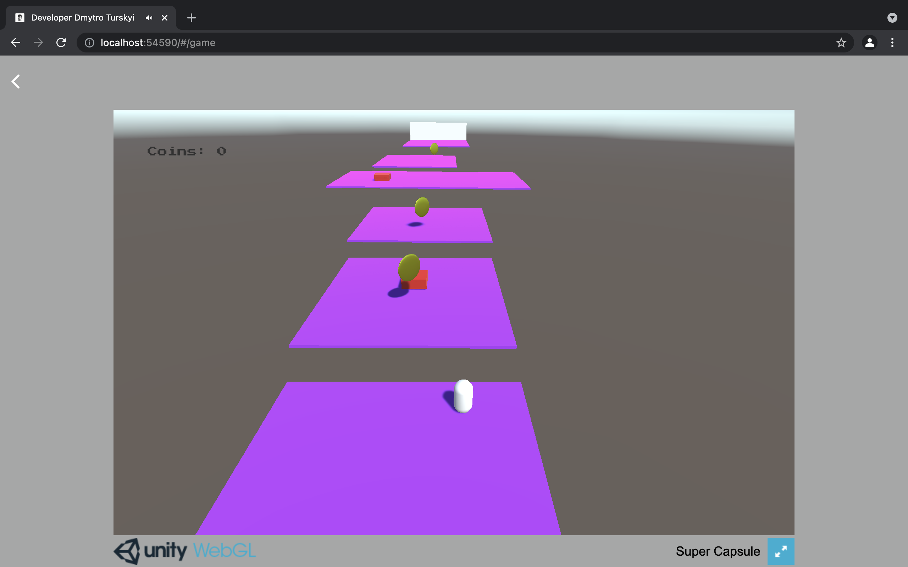
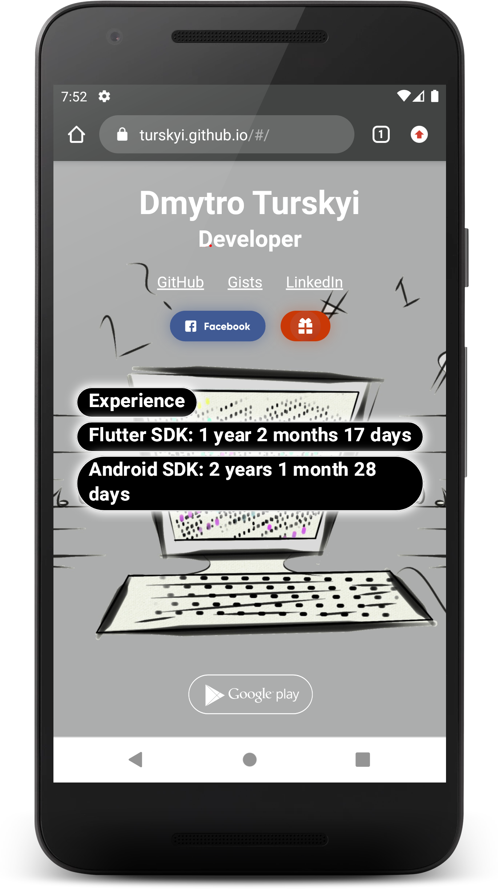

# Developer Dmytro Turskyi landing page

The Flutter project for supporting personal website
[turskyi.com](https://turskyi.com).

## PROJECT SPECIFICATION

- Programming language: [Dart](https://dart.dev/);

- SDK: [Flutter](https://flutter.dev/);

- State management approach:
  [Provider](https://flutter.dev/docs/development/data-and-backend/state-mgmt/simple);

- Version control system: [Git](https://git-scm.com);

- Git Hosting Service: [GitHub](https://github.com);

- CI/CD: [GitHub Actions](https://docs.github.com/en/actions) is used to deploy
  the updated site to
  [GitHub Pages](https://pages.github.com/) after every push to the `master`
  branch;

- Web content hosting and a domain: [turskyi.com](https://turskyi.com);

- Generated release build https://github.com/Turskyi/turskyi.github.io;

- **Code Readability:** code is easily readable with no unnecessary blank lines,
  no unused variables
  or methods, and no commented-out code, all variables, methods, and resource
  IDs
  are descriptively
  named such that another developer reading the code can easily understand their
  function.

  
Architectural pattern:

[Monolithic Model-View-Presenter](https://learn.microsoft.com/en-us/dotnet/architecture/modern-web-apps-azure/common-web-application-architectures#what-is-a-monolithic-application)

  

<a href="https://sites.libsyn.com/412964/onion-architecture-episode-2">
<!--suppress CheckImageSize -->

</a>

## Screenshots:

<!--suppress CheckImageSize -->

<!--suppress CheckImageSize -->

<!--suppress CheckImageSize -->

## Contact:

For any inquiries please reach out to me directly at
[dmytro@turskyi.com](mailto:dmytro@turskyi.com).

# Disclaimer:

I am aware that building a landing page with [Flutter](https://flutter.dev/)
is not ideal due to its lack of SEO optimization and server-side rendering
support. Flutter web is more suitable for building web apps rather than
traditional websites. The current business idea of this project is a website,
which should ideally be implemented using a more appropriate framework such as
[Next.js](https://nextjs.org/). In the future, this project will be migrated
to Next.js unless Flutter starts supporting SEO optimization and server-side
rendering.

